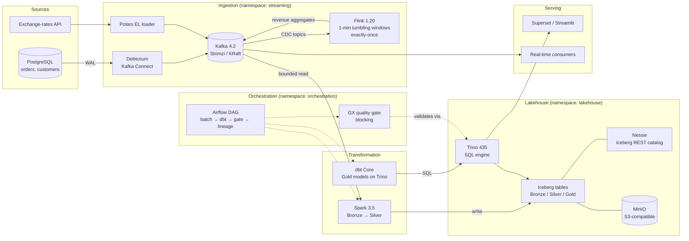
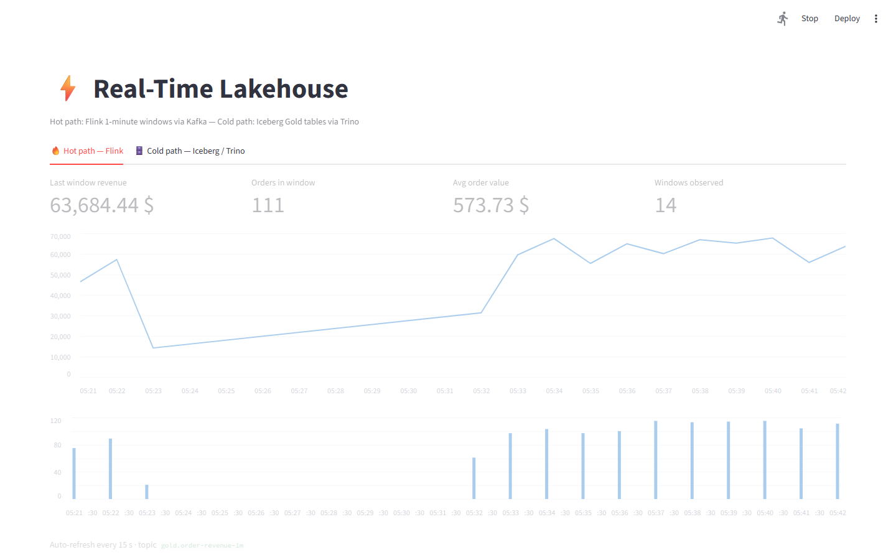

# Real-Time Lakehouse

[](https://github.com/yvan-ai/real-time-lakehouse/actions/workflows/ci.yml)
[](https://yvan-ai.github.io/real-time-lakehouse/)
[](LICENSE)
[](https://www.python.org/)
[](https://spark.apache.org/)
[](https://flink.apache.org/)
[](https://iceberg.apache.org/)

A production-grade **streaming + batch lakehouse** that fits on a single 16 GB laptop:
**~60 s from a Postgres commit to a live dashboard** on the hot path, **9 Iceberg tables**
across a medallion architecture, and **9 expectation suites + 10 dbt tests** gating every
run — under simulated e-commerce load.

Postgres changes are captured by **Debezium CDC** and streamed through **Kafka**; **Flink**
aggregates them in real time (exactly-once, 1-minute event-time windows) while **Spark** and
**dbt on Trino** build the Bronze→Silver→Gold **Iceberg** layers on **MinIO**. A daily
**Airflow** DAG chains batch → dbt → a **blocking quality gate** → lineage, and the 80+
Kubernetes resources are reconciled from git by **ArgoCD** and provisioned by **Terraform**.

## Architecture



Two paths consume the same CDC stream:

- **Hot path** — Flink aggregates order revenue in 1-minute event-time tumbling windows
  (watermarks, exactly-once checkpoints) and publishes to a `gold.order-revenue-1m` topic.
- **Cold path** — Spark lands the raw CDC envelopes in Bronze and deduplicates into Silver
  (last-write-wins on `ts_ms`); dbt builds the Gold KPI tables on Trino. A daily Airflow DAG
  chains both with a blocking Great Expectations gate and lineage registration.

## Tech stack

| Layer | Technology | Role |
|---|---|---|
| CDC | Debezium 3.1 (Kafka Connect) | Streams Postgres WAL changes as events |
| Event bus | Kafka 4.2 (Strimzi operator, KRaft) | Durable, replayable transport |
| Stream processing | Flink 1.20 (PyFlink Table API) | Real-time windowed aggregation, exactly-once |
| Batch processing | Spark 3.5 (PySpark) | Medallion transformations Bronze→Silver→Gold |
| Table format | Iceberg 1.5 | ACID tables, schema evolution, time travel |
| Catalog | Nessie 0.62 | Iceberg REST catalog (no Hive metastore) |
| Object store | MinIO | S3-compatible warehouse storage |
| Query engine | Trino 435 | Federated SQL over Iceberg |
| Transformation | dbt Core (dbt-trino) | SQL-first Gold models + tests, docs on Pages |
| Orchestration | Airflow 2.10 (standalone) | Daily DAG: batch → dbt → quality gate → lineage |
| EL ingestion | Polars loader | Exchange-rates API → `raw.events` topic (second lane) |
| Data quality | Great Expectations | Suites per layer + post-batch quality gate (K8s Job) |
| Lineage | OpenLineage + Marquez | Automatic Spark lineage, dbt emitter, declarative edges |
| Deployment | Kubernetes (k3s) + Kustomize | Declarative manifests, WSL2-friendly |
| IaC | Terraform | Operators via Helm releases (local), EKS+MSK+S3 skeleton (cloud) |
| GitOps / CI | ArgoCD core + GitHub Actions | Auto-sync from main; lint, tests, images, Data Docs |
| Observability | Prometheus + Grafana | Pipeline / Kafka / Flink dashboards & runbook'd alerts |
| BI serving | Superset (Compose profile `bi`) | Dashboards on the Gold tables through Trino |

## Key features

- **Exactly-once streaming** — Flink checkpoints (60 s interval, RocksDB state backend on S3)
  with event-time watermarks and idle-source handling.
- **Medallion architecture with intentional write strategies** — append-only Bronze,
  merge-on-read Silver (CDC upserts), copy-on-write Gold (full refresh), each with tuned
  partitioning (`days()`, `bucket()`) and file sizes.
- **Single source of truth for schemas** — Iceberg DDL in `data/models/iceberg/`, JSON Schemas
  in `data/schemas/`, and a data contract in `data/contracts/` all describe the same entities.
- **Orchestrated, gated, reconciled** — a daily Airflow DAG chains Spark, dbt and a
  blocking Great Expectations gate; ArgoCD core auto-syncs the cluster from `main`;
  Terraform owns the operators (ADR-0010 draws the IaC boundaries).
- **Everything fits in 16 GB** — every pod defines requests/limits; the full stack is tuned
  for WSL2 (see [docs/architecture.md](docs/architecture.md#resource-budget)).
- **No plaintext secrets** — credentials come from gitignored env files rendered into
  Kubernetes Secrets by Kustomize; CI validates manifests with a placeholder.

## Quick start

### Option A — Full stack on k3s (recommended)

```bash
# 1. Provision everything: k3s, Strimzi, Flink operator, MinIO, Postgres,
#    Kafka, Nessie, Trino, monitoring, topics, Debezium connector
./scripts/bootstrap.sh

# 2. Create the Iceberg tables (runs Spark in Docker, no local install)
./scripts/run-iceberg-init.sh

# 3. Run the batch pipeline Bronze → Silver → Gold
#    (on success the Great Expectations quality gate runs automatically)
./scripts/run-batch.sh
#    …or let Airflow drive it: batch → dbt → gate → lineage
kubectl port-forward svc/airflow 8081:8080 -n orchestration
# → http://localhost:8081, trigger the lakehouse_batch DAG

# 4. Query with Trino
kubectl port-forward svc/trino 8080:8080 -n lakehouse
# → SELECT * FROM iceberg.gold.daily_revenue;
```

### Option B — Lightweight dev stack (no Kubernetes)

```bash
cp .env.example .env          # set your own dev credentials
make dev-up                   # Postgres + Kafka + MinIO + Nessie via Docker Compose
```

## Live demo

With the stack running, one command starts an **e-commerce traffic simulator** and a
**real-time dashboard**:

```bash
pip install -r demo/requirements.txt
make demo        # → dashboard at http://localhost:8501
```



- The generator ([demo/generate_traffic.py](demo/generate_traffic.py)) creates customers
  and orders, progresses statuses and cancels a few — every commit becomes a CDC event.
- The **hot path tab** streams Flink's 1-minute revenue windows straight from Kafka
  (via a Strimzi nodeport listener) — new aggregates appear ~1 minute after the orders.
- The **cold path tab** queries the Gold Iceberg tables through Trino
  (run `./scripts/run-batch.sh` to refresh them mid-demo).

### Development workflow

```bash
make setup      # install dev dependencies + pre-commit hooks
make lint       # ruff + yamllint
make typecheck  # mypy
make test       # pytest (local PySpark, no cluster needed)
make validate   # kustomize build + kubeconform
```

## Project structure

```
├── .github/workflows/        # CI (lint, tests, kubeconform, image builds) + CD (ArgoCD)
├── data/
│   ├── models/iceberg/       # Iceberg DDL — bronze / silver / gold
│   ├── schemas/              # JSON Schemas for CDC payloads
│   └── contracts/            # Data contracts (SLA, ownership, quality)
├── demo/                     # Traffic simulator + Streamlit dashboard (make demo)
├── docs/
│   ├── architecture.md       # Detailed design & resource budget
│   └── decisions/            # Architecture Decision Records (ADRs)
├── infra/
│   ├── kubernetes/           # Kustomize bases + local overlay (secrets split out)
│   ├── argocd/               # GitOps project & applications (auto-sync)
│   └── terraform/            # local: operators via Helm · aws: EKS+MSK+S3 skeleton
├── observability/            # Prometheus rules, Grafana dashboards, Superset exports
├── pipelines/
│   ├── streaming/            # Flink job, Kafka topics, Debezium/Connect
│   ├── batch/                # Bronze/Silver/Gold PySpark jobs + prebaked image
│   ├── dbt/                  # SQL-first Gold models on Trino + dbt tests
│   ├── ingestion/            # Polars EL loader (exchange rates → raw.events)
│   └── orchestration/dags/   # Airflow lakehouse_batch DAG
├── quality/
│   ├── great-expectations/   # Expectation suites & checkpoints per layer
│   └── tests/                # Unit tests (pytest + local SparkSession)
└── scripts/                  # bootstrap, deploy, test, batch & init runners
```

## Data model (medallion)

| Layer | Namespace | Tables | Write mode | Partitioning |
|---|---|---|---|---|
| Bronze | `raw` | `kafka_events`, `cdc_orders`, `cdc_customers`, `cdc_order_items` | append-only | `days(ingested_at)` |
| Silver | `silver` | `orders`, `customers`, `order_items` | merge-on-read upsert | `days(created_at)` ± `bucket(16, order_id)` |
| Gold | `gold` | `daily_revenue`, `customer_metrics` | copy-on-write refresh | `months(report_date)` / `bucket(32, customer_id)` |

Bronze keeps the **full Debezium envelope** (`op`, `ts_ms`, `before`, `after`) so any Silver
logic can be replayed from raw history. Silver applies **last-write-wins deduplication** per
business key. Gold serves dashboards with pre-aggregated KPIs (daily revenue, customer
lifetime value, churn flags).

## Technical decisions

Key choices are documented as ADRs in [docs/decisions/](docs/decisions/):

- [ADR-0002](docs/decisions/0002-nessie-rest-catalog-over-hadoop.md) — Nessie REST catalog instead of Hadoop/Hive metastore
- [ADR-0003](docs/decisions/0003-strimzi-kafka-on-k3s.md) — Strimzi-operated Kafka in KRaft mode
- [ADR-0004](docs/decisions/0004-debezium-cdc-over-polling.md) — Log-based CDC with Debezium over batch polling
- [ADR-0005](docs/decisions/0005-iceberg-write-strategies-per-layer.md) — Per-layer Iceberg write strategies
- [ADR-0006](docs/decisions/0006-gitops-deployment-with-argocd.md) — GitOps deployment with ArgoCD
- [ADR-0007](docs/decisions/0007-quality-gate-as-deployment-blocker.md) — Quality gate as a deployment blocker
- [ADR-0008](docs/decisions/0008-openlineage-marquez.md) — Data lineage with OpenLineage and Marquez
- [ADR-0009](docs/decisions/0009-airflow-orchestration.md) — Airflow (standalone-style) for orchestration
- [ADR-0010](docs/decisions/0010-iac-boundaries.md) — IaC boundaries: Terraform vs kustomize vs ArgoCD
- [ADR-0011](docs/decisions/0011-lightweight-el-over-airbyte.md) — Lightweight Polars EL loader over Airbyte

## Testing & quality

- **Unit tests** (`quality/tests/`) — CDC envelope parsing, last-write-wins deduplication,
  revenue/churn business rules, run against a local SparkSession in CI.
- **Data quality gate** (`quality/great-expectations/`) — one expectation suite per table,
  checkpoints per layer, plus a custom cross-column churn-consistency check via Trino.
  After every batch, a `quality-gate` Kubernetes Job replays all suites against Trino:
  any failed expectation turns the Job red, pushes `gx_*` metrics to Prometheus and fires
  the `QualityGateFailed` alert ([ADR-0007](docs/decisions/0007-quality-gate-as-deployment-blocker.md)).
  Browsable suites: [Data Docs](https://yvan-ai.github.io/real-time-lakehouse/), published by CI.
- **Manifest validation** — every PR renders the full Kustomize overlay and validates it
  with kubeconform.
- **Static analysis** — ruff (lint + format), mypy, yamllint, pre-commit hooks.

## Data lineage

Marquez (namespace `lineage`) stores the OpenLineage graph
([ADR-0008](docs/decisions/0008-openlineage-marquez.md)):

- **Spark — automatic**: the batch Job loads `openlineage-spark` and emits the
  Bronze→Silver→Gold graph (Kafka source included, schema facets) on every run.
- **dbt — automatic**: the `dbt_build_gold` DAG task runs `dbt-ol build`, adding the
  silver → dbt → gold edges with model metadata.
- **Debezium, Flink & the EL loader — declarative**:
  [scripts/register_lineage.py](scripts/register_lineage.py) registers
  Postgres → `debezium.public.*` (connector),
  `debezium.public.orders` → `gold.order-revenue-1m` (Flink job) and
  Frankfurter API → `raw.events` (exchange-rates loader) via the OpenLineage API.

```bash
kubectl port-forward svc/marquez 5000:5000 -n lineage &
python3 scripts/register_lineage.py                        # upstream edges
kubectl port-forward svc/marquez-web 3000:3000 -n lineage  # → http://localhost:3000
```

## BI serving (Superset)

Superset runs in the Compose dev stack under the opt-in `bi` profile — Docker-side RAM,
not the k3s budget — with the `Trino-Iceberg` connection pre-registered against the
port-forwarded cluster Trino:

```bash
kubectl port-forward svc/trino 8080:8080 -n lakehouse --address 0.0.0.0 &
docker compose -f docker-compose.dev.yml --profile bi up -d superset
# → http://localhost:8088 (admin / $SUPERSET_ADMIN_PASSWORD)
```

Dashboards on `gold.daily_revenue` and `gold.customer_metrics` are versioned as native
exports in [observability/superset/](observability/superset/) (import/export round-trip
documented there).

## Results & metrics

Measured on the demo e-commerce load (traffic generator) on a single 16 GB WSL2 laptop:

| Metric | Value |
|---|---|
| Hot-path latency (Postgres commit → dashboard) | ~60 s (1-minute event-time windows) |
| Iceberg tables (Bronze / Silver / Gold) | 9 (4 / 3 / 2) |
| Data-quality checks gating each run | 9 GX suites + 10 dbt tests, blocking gate Job |
| Kubernetes resources under GitOps | 80+ across 9 quota-guarded namespaces |
| CI checks on every commit | 10 jobs — lint, types, unit tests, dbt, Terraform, kubeconform, images, docs |
| Architecture Decision Records | 11 |

## Roadmap

The three pillars of [docs/roadmap.md](docs/roadmap.md) are implemented:

- [x] **Data quality**: automated Great Expectations gate after each batch + published Data Docs
- [x] **Observability**: pipeline business dashboard, postgres/MinIO exporters, actionable alerts
- [x] **Lineage**: OpenLineage + Marquez — automatic Spark lineage, declarative CDC graph

Roadmap v2 (detailed plan in [docs/roadmap.md](docs/roadmap.md#roadmap-v2--orchestration-transformation--serving)):

- [x] **Airflow** — DAG-driven pipeline with the quality gate as a blocking task
- [x] **dbt Core on Trino** — SQL-first Gold layer, tested, emitting lineage to Marquez
- [x] **ArgoCD effectif** — core install, cluster auto-synced from git
- [x] **Terraform** — operators via Helm releases (local) + EKS/MSK/S3 skeleton (cloud path)
- [x] **Second ingestion path** — Polars loader for exchange rates → `raw.kafka_events`
- [x] **Superset** — BI serving profile on the Gold tables through Trino
- [x] Hardening: prebaked Spark batch image (jars + jobs bundled)
- [ ] Next: Iceberg maintenance DAG, External Secrets Operator, GX 1.x migration

## Contact

**Yvan Kenne** — [GitHub @yvan-ai](https://github.com/yvan-ai) · kenneyvan65@gmail.com

Licensed under the [MIT License](LICENSE).
