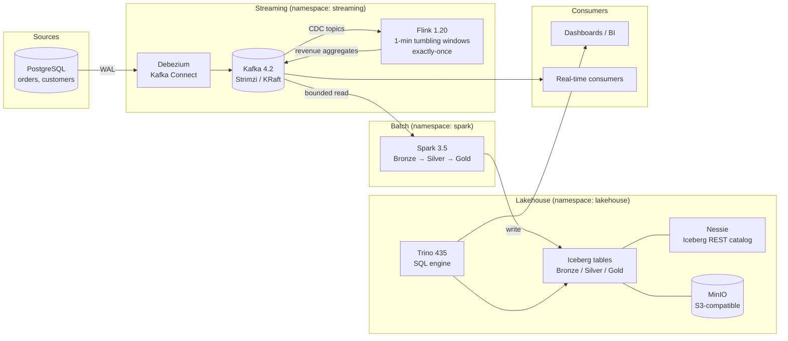

# Real-Time Lakehouse

[](https://github.com/yvan-ai/real-time-lakehouse/actions/workflows/ci.yml)
[](LICENSE)
[](https://www.python.org/)
[](https://spark.apache.org/)
[](https://flink.apache.org/)
[](https://iceberg.apache.org/)

A production-grade **streaming + batch lakehouse** that fits on a single 16 GB laptop.
Database changes are captured with **Debezium CDC**, streamed through **Kafka**, aggregated
in real time by **Flink** (exactly-once, 1-minute event-time windows), and landed by **Spark**
into **Apache Iceberg** tables on **MinIO** — all queryable through **Trino** and deployed on
Kubernetes with **GitOps (ArgoCD)**.

## Architecture



Two paths consume the same CDC stream:

- **Hot path** — Flink aggregates order revenue in 1-minute event-time tumbling windows
  (watermarks, exactly-once checkpoints) and publishes to a `gold.order-revenue-1m` topic.
- **Cold path** — Spark batch jobs land the raw CDC envelopes in Bronze, deduplicate into
  Silver (last-write-wins on `ts_ms`), and pre-aggregate Gold KPI tables.

## Tech stack

| Layer | Technology | Role |
|---|---|---|
| CDC | Debezium 3.1 (Kafka Connect) | Streams Postgres WAL changes as events |
| Event bus | Kafka 4.2 (Strimzi operator, KRaft) | Durable, replayable transport |
| Stream processing | Flink 1.20 (PyFlink Table API) | Real-time windowed aggregation, exactly-once |
| Batch processing | Spark 3.5 (PySpark) | Medallion transformations Bronze→Silver→Gold |
| Table format | Iceberg 1.5 | ACID tables, schema evolution, time travel |
| Catalog | Nessie 0.62 | Iceberg REST catalog (no Hive metastore) |
| Object store | MinIO | S3-compatible warehouse storage |
| Query engine | Trino 435 | Federated SQL over Iceberg |
| Data quality | Great Expectations | Expectation suites per medallion layer |
| Orchestration | Kubernetes (k3s) + Kustomize | Declarative deployment, WSL2-friendly |
| GitOps / CI | ArgoCD + GitHub Actions | Lint, tests, image build, auto-sync |
| Observability | Prometheus + Grafana | Kafka / Flink / cluster dashboards & alert rules |

## Key features

- **Exactly-once streaming** — Flink checkpoints (60 s interval, RocksDB state backend on S3)
  with event-time watermarks and idle-source handling.
- **Medallion architecture with intentional write strategies** — append-only Bronze,
  merge-on-read Silver (CDC upserts), copy-on-write Gold (full refresh), each with tuned
  partitioning (`days()`, `bucket()`) and file sizes.
- **Single source of truth for schemas** — Iceberg DDL in `data/models/iceberg/`, JSON Schemas
  in `data/schemas/`, and a data contract in `data/contracts/` all describe the same entities.
- **Everything fits in 16 GB** — every pod defines requests/limits; the full stack is tuned
  for WSL2 (see [docs/architecture.md](docs/architecture.md#resource-budget)).
- **No plaintext secrets** — credentials come from gitignored env files rendered into
  Kubernetes Secrets by Kustomize; CI validates manifests with a placeholder.

## Quick start

### Option A — Full stack on k3s (recommended)

```bash
# 1. Provision everything: k3s, Strimzi, Flink operator, MinIO, Postgres,
#    Kafka, Nessie, Trino, monitoring, topics, Debezium connector
./scripts/bootstrap.sh

# 2. Create the Iceberg tables (runs Spark in Docker, no local install)
./scripts/run-iceberg-init.sh

# 3. Run the batch pipeline Bronze → Silver → Gold
./scripts/run-batch.sh

# 4. Query with Trino
kubectl port-forward svc/trino 8080:8080 -n lakehouse
# → SELECT * FROM iceberg.gold.daily_revenue;
```

### Option B — Lightweight dev stack (no Kubernetes)

```bash
cp .env.example .env          # set your own dev credentials
make dev-up                   # Postgres + Kafka + MinIO + Nessie via Docker Compose
```

### Development workflow

```bash
make setup      # install dev dependencies + pre-commit hooks
make lint       # ruff + yamllint
make typecheck  # mypy
make test       # pytest (local PySpark, no cluster needed)
make validate   # kustomize build + kubeconform
```

## Project structure

```
├── .github/workflows/        # CI (lint, tests, kubeconform, image builds) + CD (ArgoCD)
├── data/
│   ├── models/iceberg/       # Iceberg DDL — bronze / silver / gold
│   ├── schemas/              # JSON Schemas for CDC payloads
│   └── contracts/            # Data contracts (SLA, ownership, quality)
├── docs/
│   ├── architecture.md       # Detailed design & resource budget
│   └── decisions/            # Architecture Decision Records (ADRs)
├── infra/
│   ├── kubernetes/           # Kustomize bases + local overlay
│   └── argocd/               # GitOps project & applications
├── observability/            # Prometheus rules, Grafana dashboards
├── pipelines/
│   ├── streaming/            # Flink job, Kafka topics, Debezium/Connect
│   └── batch/spark-jobs/     # Bronze / Silver / Gold PySpark jobs + shared lib
├── quality/
│   ├── great-expectations/   # Expectation suites & checkpoints per layer
│   └── tests/                # Unit tests (pytest + local SparkSession)
└── scripts/                  # bootstrap, deploy, test, batch & init runners
```

## Data model (medallion)

| Layer | Namespace | Tables | Write mode | Partitioning |
|---|---|---|---|---|
| Bronze | `raw` | `kafka_events`, `cdc_orders`, `cdc_customers`, `cdc_order_items` | append-only | `days(ingested_at)` |
| Silver | `silver` | `orders`, `customers`, `order_items` | merge-on-read upsert | `days(created_at)` ± `bucket(16, order_id)` |
| Gold | `gold` | `daily_revenue`, `customer_metrics` | copy-on-write refresh | `months(report_date)` / `bucket(32, customer_id)` |

Bronze keeps the **full Debezium envelope** (`op`, `ts_ms`, `before`, `after`) so any Silver
logic can be replayed from raw history. Silver applies **last-write-wins deduplication** per
business key. Gold serves dashboards with pre-aggregated KPIs (daily revenue, customer
lifetime value, churn flags).

## Technical decisions

Key choices are documented as ADRs in [docs/decisions/](docs/decisions/):

- [ADR-0002](docs/decisions/0002-nessie-rest-catalog-over-hadoop.md) — Nessie REST catalog instead of Hadoop/Hive metastore
- [ADR-0003](docs/decisions/0003-strimzi-kafka-on-k3s.md) — Strimzi-operated Kafka in KRaft mode
- [ADR-0004](docs/decisions/0004-debezium-cdc-over-polling.md) — Log-based CDC with Debezium over batch polling
- [ADR-0005](docs/decisions/0005-iceberg-write-strategies-per-layer.md) — Per-layer Iceberg write strategies
- [ADR-0006](docs/decisions/0006-gitops-deployment-with-argocd.md) — GitOps deployment with ArgoCD

## Testing & quality

- **Unit tests** (`quality/tests/`) — CDC envelope parsing, last-write-wins deduplication,
  revenue/churn business rules, run against a local SparkSession in CI.
- **Data quality** (`quality/great-expectations/`) — one expectation suite per table,
  checkpoints per layer, plus a custom cross-column churn-consistency check via Trino.
- **Manifest validation** — every PR renders the full Kustomize overlay and validates it
  with kubeconform.
- **Static analysis** — ruff (lint + format), mypy, yamllint, pre-commit hooks.

## Roadmap

- [ ] dbt models on Trino for the Gold layer (replace PySpark aggregations)
- [ ] Airflow DAG to schedule the batch pipeline
- [ ] OpenLineage integration for column-level lineage
- [ ] External Secrets Operator for credential management
- [ ] Terraform modules for a cloud deployment (EKS + MSK + S3)
- [ ] Iceberg maintenance jobs (compaction, snapshot expiry) on a schedule

## Contact

**Yvan Kenne** — [GitHub @yvan-ai](https://github.com/yvan-ai) · kenneyvan65@gmail.com

Licensed under the [MIT License](LICENSE).
